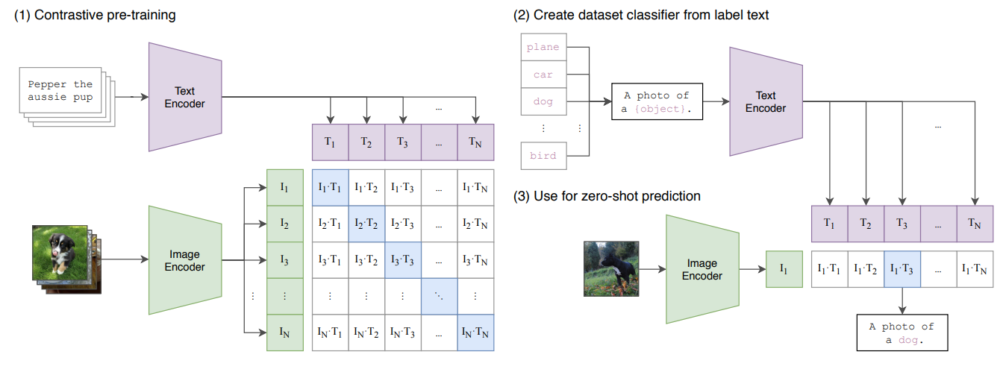

# VCED

VCED: Video Clip Extraction by description 该项目可以通过文字描述来自动识别视频中相符合的片段进行视频剪辑。通过跨模态模型与向量检索技术，结合前后端分离的模式，帮助你快速接触新一代搜索技术。

## VCED 是如何工作的

VCED 项目的核心逻辑是通过多模态模型 CLIP 实现的，具体结构如下图所示：


图片源自：《[Learning transferable visual models from natural language supervision](https://arxiv.org/pdf/2103.00020.pdf)》

- 首先将输入的文本通过 Text Encoder 进行 encoding，将文本转换为高维向量。
- 其次将上传的视频通过 Image Encoder 进行 encoding，一般上传的视频会通过抽取关键帧的方式对内容进行提取，最终将上传的视频提取为多个图像，并对提起的关键帧转化为高维向量。Text/Image Encoder 根据业务需要的不同可以选择不同的 AI 模型
- 跨模态模型的目的是将文本生成的向量数据与关键帧生成的向量数据映射到同一高维空间下，并使得文本描述与关键帧相符合的向量之间的距离尽可能的近
- 再将得到的高维向量进行存储，因为数据量可能较大，一般业务上会采用索引的方式来快速的对向量数据进行检索，常用的索引方法比如 PQ 算法，HNSW 算法等
- 最后加入再输入一段文本后就可以用相同的方法将生成的向量与存储的向量进行比对，判断哪些向量之间的距离比较近，得到一个相似性分数，即可以找到离文本描述最相似的关键帧，再对原视频进行定位，最终找到相似的视频片段

为了实现以上几个步骤，在本项目中引入了以下组件：

- 为了解决如何对视频进行关键帧提取的问题，我们使用到了 ffmpeg，对应的实现方法在 [videoLoader](https://github.com/datawhalechina/vced/blob/709de9a0a0ce6a0b534c243c5bb58e00a08c6379/code/service/videoLoader/video_loader.py) 中
- 为了解决如何将文本与图像转换为向量的问题，我们使用到了 jina 的 DocArray，对应处理文本的方法在 [customClipText](https://github.com/datawhalechina/vced/blob/709de9a0a0ce6a0b534c243c5bb58e00a08c6379/code/service/customClipText/clip_text.py) 中，对应处理图像的方法在 [customClipImage](https://github.com/datawhalechina/vced/blob/709de9a0a0ce6a0b534c243c5bb58e00a08c6379/code/service/customClipImage/clip_image.py) 中
- 为了解决如何将生成的向量数据存储以及检索的问题，我们使用到了 jina 自带的向量搜索方法，对应的实现方法在 [customIndexer](https://github.com/datawhalechina/vced/blob/709de9a0a0ce6a0b534c243c5bb58e00a08c6379/code/service/customIndexer/executor.py) 中
- 为了解决前端显示的问题，我们使用到了 [Streamlit](https://streamlit.io/) 框架实现前端效果，对应的实现方法在 [web/app.py](https://github.com/datawhalechina/vced/blob/709de9a0a0ce6a0b534c243c5bb58e00a08c6379/code/web/app.py) 中

在了解了本项目的逻辑后就让我们对这些组件进行进一步介绍，希望能够激发你更多的创造灵感😁

> 本项目仅仅实现了一些基础的功能，还有许多可以完善的地方，下面就简单的列一些可以完善的点供你参考：<br/>
> 1. 目前向量检索使用的是最简单的暴力搜索，所以向量检索花费的时间很慢，这里可以优化
> 2. 目前跨模态模型这里使用了比较大众的模型，文本与视频的匹配度有待提升<br/>
> 
> 还有许多地方可以完善，或者将这个项目扩充更多的功能，欢迎你发挥聪明才智作出更令人惊艳的作品🥰

```{toctree}
:maxdepth: 2

user_guide/index
```
