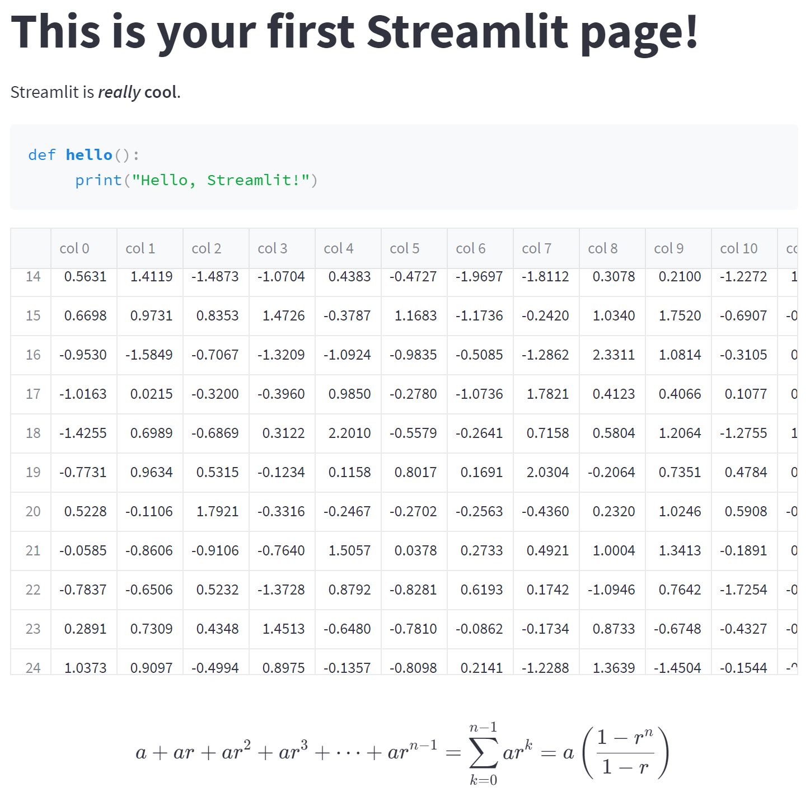

# Streamlit

[Streamlit](https://streamlit.io/) 是一个基于 Python 的 Web 应用程序框架，可以帮助数据科学家和学者在短时间内开发机器学习可视化仪表板。只需几行代码，就可以构建并部署强大的数据应用程序。其特点如下：

- **跨平台**，支持 Windows、macOS、linux
- **只需要掌握 Python**，开发者就可以构建 Web App，不需要有任何的前端基础
- **开源**，社区资源丰富（[Community forum](https://discuss.streamlit.io/)、[Github](https://github.com/streamlit/streamlit/)）

由于 Streamlit 基于 Python，开发者无需学习其他就可以搭建一个较为完整的系统。此次教程，我们团队就通过 **Streamlit + Jina** 构建了一套系统。

## 快速开始

在开始之前，你需要确保你的电脑有以下环境：

- 一个 IDE 或者文本编辑器
- Python 3.7 - Python 3.10
- pip

安装 Streamlit 非常简单，打开终端，执行：

```bash
pip install streamlit
```

官方提供了一个预设网页：

```bash
streamlit hello
```

如果你能正常运行并打开该网页，说明你的 Streamlit 安装成功了！

## 自由开发

Streamlit 框架提供了很多 [API](https://docs.streamlit.io/library/api-reference) 供开发者使用。下面的步骤将指引你一步一步构建自己的第一个 Web App：

1. 打开 IDE（如 vscode），创建一个 `hello-streamlit.py` 文件，输入：

```python
import streamlit as st
```

2. 每个Web页面都会有一个title，如下图所示：


  
```python
st.set_page_config(page_title="Hello Streamlit")
```

3. Streamlit API 中提供了很多页面中常见的 elements：

```python
st.title('This is your first Streamlit page!')  # 标题

st.markdown('Streamlit is **_really_ cool**.')  # markdown

code = '''def hello():
     print("Hello, Streamlit!")'''
st.code(code, language='python')  # code

df = pd.DataFrame(
     np.random.randn(50, 20),
     columns=('col %d' % i for i in range(20)))
st.dataframe(df)  # dataframe

st.latex(r'''
     a + ar + a r^2 + a r^3 + \cdots + a r^{n-1} =
     \sum_{k=0}^{n-1} ar^k =
     a \left(\frac{1-r^{n}}{1-r}\right)
     ''')  # latex
```

4. 打开终端，输入如下命令启动Streamlit：

```bash
streamlit run main.py
```

界面如下：



完整代码参见 [`hello-streamlit.py`](https://github.com/datawhalechina/vced/blob/709de9a0a0ce6a0b534c243c5bb58e00a08c6379/docs/source/user_guide/Frontend/hello-streamlit.py)

这里只介绍了 Streamlit 的冰山一角，更多特性和细节感兴趣的同学可以去官网进一步学习。另外，官网也有很多 [Streamlit 模板](https://streamlit.io/gallery)，可以帮助你更高效地搭建自己的应用。
