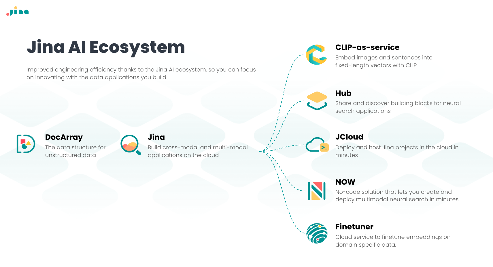

# Jina相关内容介绍

[TOC]

## 1. Jina AI

Jina AI是一个基于云原生和人工智能的开源神经搜索框架，它允许任何人在云上构建跨模式和多模式应用程序。 

### 1.1 特点

- 微服务

  保证每个步骤以分布形式独立运行

- 编排系统

  负责协调流水线的持续运行和弹性伸缩

- 容器化技术

  保证每个步骤都有独立的运行环境

- 可观测

  及时获取故障原因

### 1.2 全家桶



- **DocArray** — **非结构化数据**的数据结构
- **Jina** — 用于任何类型数据的云原生**神经搜索框架**
- **Hub** — 分享和发现**可重复使用的神经搜索应用程序构建块**的市场
- **Finetuner** — 对任何深度神经网络进行**微调**，以便在神经搜索任务中优化嵌入
- **NOW** — **图像搜索**的无代码解决方案
- **CLIP-as-service** — 基于CLIP的图像和文本的**跨模态编码服务**
- **JCloud** — 神经搜索系统的**云端部署及管理平台**

本次项目中重点介绍Jina和DocArray，其余模块，有兴趣的同学可自行去官网学习。


## 2 Jina

### 2.1 Jina的定义

Jina 是一个基于云原生的深度学习搜索框架，赋能开发者打造可靠的云原生多模态、跨模态的搜索系统。

### 2.2 Jina的基本概念

Document、Executor 和 Flow 是 Jina 的三个基本概念。
- Document 是基本的数据类型，会在 DocArray 中细说。
- Executor 可以理解为一个 Python 类，代表了 Jina 中的算法单元，比如把图像编码成向量、对结果进行排序等算法等都可以用 Executor 来表述。
- Flow 将多个 Executor 连接起来，可以协调成流水线(pipeline)。也可以理解成一个高阶的任务。比如索引(index)、搜索(search)、训练(train)，都属于一个 Flow。

### 2.3 Jina的安装

​    Jina需要python3.7及以上版本，支持多渠道安装，windows，linux和mac均适用。

```python
# via pypi
pip install jina

# via conda
conda install jina -c conda-forge

# via docker
docker pull jinaai/jina:latest
```

### 2.4 快速上手

我们通过下面的例子来理解Jina的基本概念：

```python
# 导入document、executor 和 Flow 这三个基本概念，以及requests装饰器
from jina import DocumentArray, Executor, Flow, requests

# 编写MyExec类，类中定义了异步函数add_text
# 该函数从网络请求接收DocumentArray，并在其后面附加"hello, world!"
class MyExec(Executor):
    @requests  # 用于指定路由
    async def add_text(self, docs: DocumentArray, **kwargs):
        for d in docs:
            d.text += 'hello, world!'

# 定义Flow，该Flow将两个Executor放到了一个链中。
# 将Flow赋值给f
f = Flow().add(uses=MyExec).add(uses=MyExec)

with f:  # 使用 with f 打开Flow
    r = f.post('/', DocumentArray.empty(2))  # 向流发送一个空的DocumentArray
    print(r.texts)
```

你也可以将上述文件内容拆开，拆分成python执行文件和yaml文件。拆分后，能提升代码的可扩展性和并发性。

```python
// toy.yml
jtype: Flow
with:
  port: 51000
  protocol: grpc
executors:
- uses: MyExec
  name: foo
  py_modules:
    - executor.py
- uses: MyExec
  name: bar
  py_modules:
    - executor.py
    
// executor.py
from jina import DocumentArray, Executor, requests


class MyExec(Executor):
    @requests
    async def add_text(self, docs: DocumentArray, **kwargs):
        for d in docs:
            d.text += 'hello, world!'
```

运行以下命令启动服务：

```shell
jina flow --uses toy.yml
```

启动成功后，可以使用客户端进行查询：

```python
from jina import Client, Document

c = Client(host='grpc://0.0.0.0:51000')  # 如果运行提示失败，可尝试使用localhost
c.post('/', Document())
```

将 Executor 和 Flow 分开有以下优点：

  - 服务器上的数据流是非阻塞和异步的。当 Executor 处于空闲状态时，会立即处理新的请求。
  - 必要时会自动添加负载平衡，以确保最大吞吐量。


## 3 DocArray

### 3.1 DocArray的定义

DocArray 是用于存储非结构化数据的数据结构工具包，是本次我们做多模态应用的基础。通过这个小而精的入口，能友好地带你走进多模态/跨模态的世界。

DocArray 的亮点在于 Hierarchy + Nested。DocArray 有不同的层级结构，分层存储，第一层可以是一个整体的视频，第二层是该视频的不同镜头，第三层可以是镜头的某一帧。也可以是其他模态，比如顶层存储文章，第二层存储句子，第三层存储词......因此可以针对某个词搜索，也可以针对句子去搜索，这样搜索的颗粒度，结构的多样性和结果的丰富度，都比传统文本检索好很多。

DocArray 的设计对于 Python 用户来说非常直观，不需要学习新的语法。它融合了Json、Pandas、Numpy、Protobuf 的优点，更适用于数据科学家和深度学习工程师。

### 3.2 DocArray的组成

DocArray由三个简单的概念组成：

- Document：一种表示嵌套非结构化数据的数据结构，是 DocArray 的基本数据类型。无论是处理文本、图像、视频、音频、3d、表格 或它们的嵌套或组合，都可以用 Document 来表示它们，从而使得各类数据的结构都非常规整，方便后续处理。 
- DocumentArray：用于高效访问、处理和理解多个文档的容器，可以保存多个 Document 的列表。
- Dataclass：用于直观表示多模式数据的高级API。

### 3.3 DocArray的安装

3.x版本的Jina已经包含了DocArray，如果你用的是3.x的Jina，可以跳过此步骤。如果你不清楚自己安装的版本号，可以在命令行里输入`jina -vf`来查看Jina版本。

如果你安装的是2.x版本的Jina，需要单独安装DocArray包。DocArray需要python3.7及以上版本，支持多渠道安装，windows，linux和mac均适用。此外，DocArray需要依赖numpy包，安装前，需先安装numpy。

```python
# via pypi
pip install docarray

# via conda
conda install -c conda-forge docarray
```

### 3.4 快速上手

```python
import docarray

# 查看docarray版本
docarray.__version__   # 如果版本号小于0.1.0，代表未成功安装docarray，程序使用的仍是Jina2.x的旧版本docarray。
```

由于本项目做的是视频搜索剪辑，这里重点介绍**文本、图像和视频**。

#### 3.4.1 文本

##### 3.4.1.1 创建文本

```python
from docarray import Document  # 导包

# 创建简单的文本数据
d = Document(text='hello, world.') 
print(d.text)  # 通过text获取文本数据
# 如果文本数据很大，或者自URI，可以先定义URI，然后将文本加载到文档中
d = Document(uri='https://www.w3.org/History/19921103-hypertext/hypertext/README.html')
d.load_uri_to_text()
print(d.text)
# 支持多语言
d = Document(text='👋	नमस्ते दुनिया!	你好世界！こんにちは世界！	Привет мир!')
print(d.text)
```

##### 3.4.1.2 切割文本

```python
from docarray import Document  # 导包

d = Document(text='👋	नमस्ते दुनिया!	你好世界！こんにちは世界！	Привет мир!')
d.chunks.extend([Document(text=c) for c in d.text.split('!')])  # 按'!'分割
d.summary()
```

##### 3.4.1.3 text、ndarray互转

```python
from docarray import DocumentArray, Document  # 导包

# DocumentArray相当于一个list，用于存放Document
da = DocumentArray([Document(text='hello world'), 
                    Document(text='goodbye world'),
                    Document(text='hello goodbye')])

vocab = da.get_vocabulary()  # 输出：{'hello': 2, 'world': 3, 'goodbye': 4}

# 转为ndarray
for d in da:
    d.convert_text_to_tensor(vocab, max_length=10)  # 转为tensor向量，max_length为向量最大值，可不设置
    print(d.tensor) 
   
 # 输出结果：
 [0 0 0 0 0 0 0 0 2 3]
 [0 0 0 0 0 0 0 0 4 3]
 [0 0 0 0 0 0 0 0 2 4]
 
 # ndarray
 for d in da:
    d.convert_tensor_to_text(vocab)
    print(d.text)

# 输出结果：
hello world
goodbye world
hello goodbye
```

##### 3.4.1.4 Demo: 简单文本匹配

```python
from docarray import Document, DocumentArray

d = Document(uri='https://www.gutenberg.org/files/1342/1342-0.txt').load_uri_to_text()
da = DocumentArray(Document(text=s.strip()) for s in d.text.split('\n') if s.strip())
da.apply(lambda d: d.embed_feature_hashing())

q = (
    Document(text='she entered the room')
    .embed_feature_hashing()  # 通过hash进行特征编码
    .match(da, limit=5, exclude_self=True, metric='jaccard', use_scipy=True)
)

print(q.matches[:, ('text', 'scores__jaccard')])

# 输出结果：
[['staircase, than she entered the breakfast-room, and congratulated', 
'of the room.', 
'She entered the room with an air more than usually ungracious,', 
'entered the breakfast-room, where Mrs. Bennet was alone, than she', 
'those in the room.'], 
[{'value': 0.6, 'ref_id': 'f47f7448709811ec960a1e008a366d49'}, 
{'value': 0.6666666666666666, 'ref_id': 'f47f7448709811ec960a1e008a366d49'}, 
{'value': 0.6666666666666666, 'ref_id': 'f47f7448709811ec960a1e008a366d49'}, 
{'value': 0.6666666666666666, 'ref_id': 'f47f7448709811ec960a1e008a366d49'}, 
{'value': 0.7142857142857143, 'ref_id': 'f47f7448709811ec960a1e008a366d49'}]]
```

#### 3.4.2 图像

​		图像部分需要提前安装Pillow和matplotlib包。首先以下图为例，进行图像部分的介绍：


##### 3.4.2.1 读取图片并转为tensor

```python
d = Document(uri='apple.png')
d.load_uri_to_image_tensor()

print(d.tensor, d.tensor.shape)
```

##### 3.4.2.2 进行简单的图像处理

```python
from docarray import Document

d = (
    Document(uri='apple.png')
    .load_uri_to_image_tensor()
    .set_image_tensor_shape(shape=(224, 224))  # 设置shape
    .set_image_tensor_normalization()  # 标准化
    .set_image_tensor_channel_axis(-1, 0)  # 更改通道
)

print(d.tensor, d.tensor.shape)

# 你可以使用save_image_tensor_to_file将tensor转为图像。当然，因为做了预处理，图片返回时损失了很多信息。
d.save_image_tensor_to_file('apple-proc.png', channel_axis=0)  # 因为前面进行了预处理，channel_axis应该设为0
```

##### 3.4.2.3 读取图像集

```python
from docarray import DocumentArray

da = DocumentArray.from_files('Downloads/*.jpg')  # 从Downloads文件夹中读取所有的jpg文件，你应该根据自己的路径设置
da.plot_image_sprites('sprite-img.png')  # 使用plot_image_sprites绘制图片集图片，如下图
```


##### 3.4.2.4 切割大型图像

由于大型复杂图像包含了太多的元素和信息，难以定义搜索问题，因此很难对其进行搜索。

以下图为例，如果要对图像进行分析，首先就需要切割图像。这里使用滑动窗口来切割图像。


```python
from docarray import Document

d = Document(uri='/image/complicated-image.jpeg')
d.load_uri_to_image_tensor()
print(d.tensor.shape)

d.convert_image_tensor_to_sliding_windows(window_shape=(64, 64))  # 使用64*64的滑窗切割原图像，切分出12*15个图像张量
print(d.tensor.shape)

# 可以通过as_chunks=True，使得上述180张图片张量添加到Document块中。P.S：运行这行代码时，需要重新load image tensor，否则会报错。
d.convert_image_tensor_to_sliding_windows(window_shape=(64, 64), as_chunks=True)
print(d.chunks)

d.chunks.plot_image_sprites('simpsons-chunks.png')  # 使用plot_image_sprites将各个chunk绘制成图片集图片
```


因为采用了滑动窗口扫描整个图像，使用了默认的stride，切分后的图像不会有重叠，所以重新绘制出的图和原图差别不大。你也可以通过设置strides参数进行过采样。

```python
d.convert_image_tensor_to_sliding_windows(window_shape=(64, 64), strides=(10, 10), as_chunks=True)
d.chunks.plot_image_sprites('simpsons-chunks-stride-10.png')
```

#### 3.4.3 视频

#### 3.4.3.1 视频导入和切分

​		视频需要依赖av包。首先，使用`load_uri_to_video_tensor`导入视频。

```python
from docarray import Document

d = Document(uri='toy.mp4')
d.load_uri_to_video_tensor()

print(d.tensor.shape)
```

​		相较于图像，视频是一个思维数组，第一维表示视频帧id或是视频的时间，剩下的三维则和图像一致。

​		举个例子，假设d.tensor.shape=（250，176，320，3），视频总长度10s。说明视频大小为176x320，包含250帧。从而推断出，帧速率约为250/10=25fps。

​		可以使用append将Document放入chunk中：

```python
for b in d.tensor:
    d.chunks.append(Document(tensor=b))

d.chunks.plot_image_sprites('mov.png')
```

#### 3.4.3.2 关键帧提取

​		我们从视频中提取的图像，很多都是冗余的，可以使用`only_keyframes`这个参数来提取关键帧：

```python
from docarray import Document

d = Document(uri='toy.mp4')
d.load_uri_to_video_tensor(only_keyframes=True)
print(d.tensor.shape)
```

#### 3.4.3.3 张量转存为视频

​		可以使用`save_video_tensor_to_file`进行视频的保存

```python
from docarray import Document

d = (
    Document(uri='toy.mp4')
    .load_uri_to_video_tensor()  # 读取视频
    .save_video_tensor_to_file('60fps.mp4', 60)  # 将其保存为60fps的视频
)
```

## 4. 附录

<!--官方文档地址-->

1.Jina:https://docs.jina.ai/

2.DocArray https://docarray.jina.ai/
